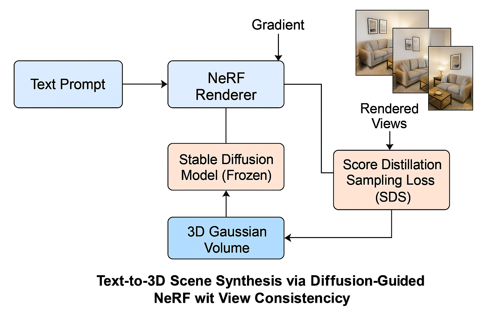

# 🧠 Text-to-3D Scene Synthesis via Diffusion-Guided NeRF with View Consistency

> An expert-level generative vision project that transforms text prompts into coherent 3D scenes using Score Distillation Sampling (SDS) with NeRF-based Gaussian representations.

---

## 🚀 Highlights

- 💬 **Text-to-3D**: Convert natural language prompts into high-quality 3D scenes.
- 🧊 **Diffusion-Guided**: Uses Stable Diffusion as a frozen guidance model.
- 🌀 **NeRF + Gaussian Splatting**: Efficient volumetric representation with learnable radiance fields.
- 🧭 **View Consistency**: Multi-view rendering regularized for photometric coherence.
- 💡 **Inspired by**: DreamFusion, Magic3D, and 3D Gaussian Splatting.

---

## 🖼️ Pipeline



---

## 📁 Project Structure

```
text2nerf_diffusion/
├── configs/
├── models/
├── utils/
├── README.md
├── render.py
├── requirements.txt
└── train.py
```

---

## 🛠️ Requirements

```bash
pip install -r requirements.txt
```

---

## 🔧 Usage

Train a 3D scene from text:

```bash
python scripts/train_sds.py --prompt "a futuristic city made of crystals"
```

Then render novel views:

```bash
python scripts/render_views.py --scene_path outputs/scene_01/
```

---

## 📚 References

- [DreamFusion](https://arxiv.org/abs/2209.14988)
- [Score Distillation Sampling (SDS)](https://arxiv.org/abs/2209.14988)
- [3D Gaussian Splatting](https://arxiv.org/abs/2308.04079)
- [Magic3D](https://arxiv.org/abs/2211.10440)

---

## 👨‍💻 Author

**Youcef Gheffari**
